# Dock structural-health analysis (Designite pilot)

**Scope:** `wieslawsoltes/Dock` (C#), the one repo currently covered on the
Designite side of this study (see `DESIGNITE_TASK.md` for why `dotnet/aspire`
isn't in this pilot). Data: `results/analysis/07-28-smell-metrics-96.csv`,
87 real per-commit rows out of 96 manifest grid points (9 fail on the known
`.slnx` gap — see "Coverage & caveats"). This is a **descriptive, exploratory
pilot read**, not the study's planned confirmatory analysis (segmented
regression with LOC/repo covariates, pre-registered primary metrics, pooled
across all 5 repos — see `Writing/Longitudinal.md` §9) — that comes later,
once DPy's side joins this.

Dock's AI-agent intervention point is **2025-06-25** (309 agent-authored PRs
total, per `Writing/Longitudinal.md` §4).

## Coverage & caveats — read this before the findings below

- **n = 1 repo, n = 87 snapshots.** Everything here is about Dock
  specifically. No cross-repo generalization is implied or supported yet.
- **The `.slnx` gap truncates the post-intervention window to ~6 months,
  not the intended ±12.** Dock migrated `Dock.sln` → `Dock.slnx` on
  2025-12-25 — exactly 6 months after the intervention point — and this
  installed Designite build can't open `.slnx`. Every post-intervention
  finding below is therefore support by 2025-06-25 through 2025-12-25 only.
- **A large, concentrated LOC-growth burst dominates the post-intervention
  period** (see first section below) — any density metric computed over
  that window is partly measuring "a codebase that just tripled in size in
  8 weeks," not a settled steady state. This is flagged wherever relevant,
  not hidden.
- **Statistical tests here are exploratory, not confirmatory.** Pre-group
  n=22, post-group n=17 (Track A2). Mann-Whitney U + Cliff's delta are
  reported per the study's planned methodology (`Writing/Results.md`), but
  with no covariate adjustment for the growth confound and no
  multiple-comparison correction — treat p-values/effect sizes as
  descriptive signal, not proof.
- **17 of the 87 rows needed LOC-cap chunking** (`n_chunks == 2`). Per
  `DESIGNITE_TASK.md`, class/method-level metrics and smell counts are valid
  to pool across chunks; **architecture-level smells and Fan-In/Fan-Out are
  not** when chunked, so `arch_smell_count_chunk_scoped` is excluded from
  every comparison below.
- **Multi-targeted projects aren't deduplicated** (a project built for more
  than one target framework produces a full duplicate metric set per
  variant) — a known, undecided skew documented in `DESIGNITE_TASK.md`.
- **`total_loc` undercounts Designite's own top-line LOC figure by
  ~18-21%** (it's a sum of `ClassMetrics.LOC`, which doesn't attribute
  `using` directives/namespace boilerplate to any class) — fine for
  relative/trend comparisons, not an exact absolute count.

## Dataset overview

| | Track A1 (calendar, monthly) | Track A2 (centered on intervention) |
|---|---|---|
| Rows (ok) | 48 | 39 |
| Date range | 2022-01-01 → 2025-12-01 | 2024-06-25 → 2025-12-25 (−365d to +183d) |
| Chunked rows | 5 | 12 |

## 1. Repo growth: a year of quiet, then an 8-week burst right at the intervention

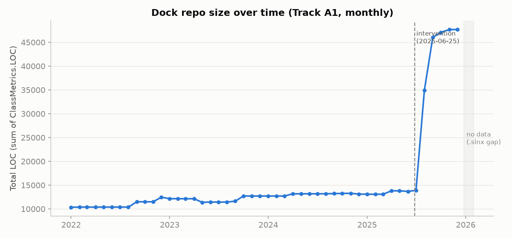

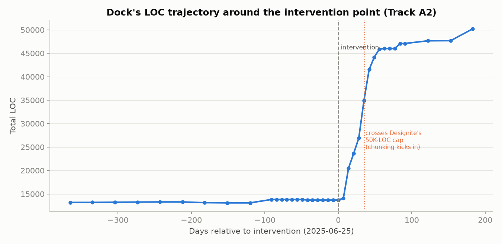

This is the single most important fact for reading everything that follows.
Dock's measured LOC was essentially flat for the full year before the
intervention (13,187 → 13,687 LOC, 2024-06-25 to 2025-06-25 — about 4%
growth in 12 months, consistent with routine maintenance). Then, starting
within days of the intervention point, it grew **235% in about 8 weeks**
(13,687 → 45,910 LOC by 2025-08-20), crossing Designite's 50,000-LOC Trial
cap and triggering this pipeline's chunking path for the first time in
Dock's history. Growth then slowed back down to a plateau (45,910 → 50,219,
another ~9% over the following 4 months).

Whatever else these metrics show, they're describing a codebase that
**roughly quadrupled in size in two months**, immediately following agent
adoption. That's a striking descriptive fact on its own, independent of any
smell-density story — and it means every "post" measurement below is drawn
from a repo in the middle of, or just after, an unusually large and
concentrated expansion, not a stable baseline.

## 2. Smell density: design and implementation smells move in opposite directions

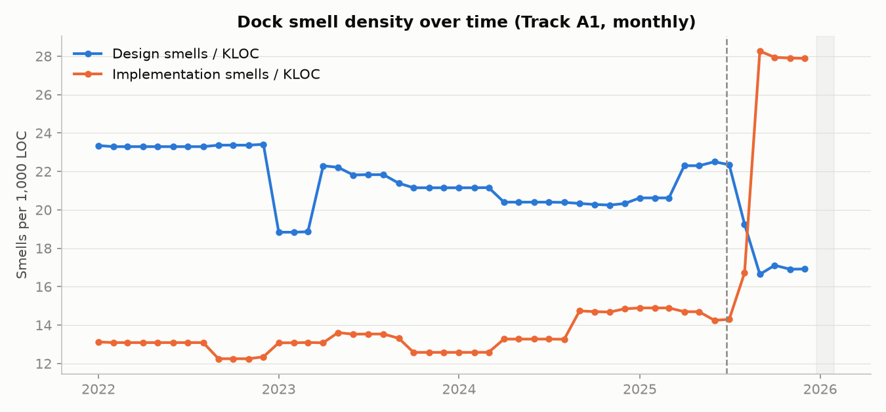

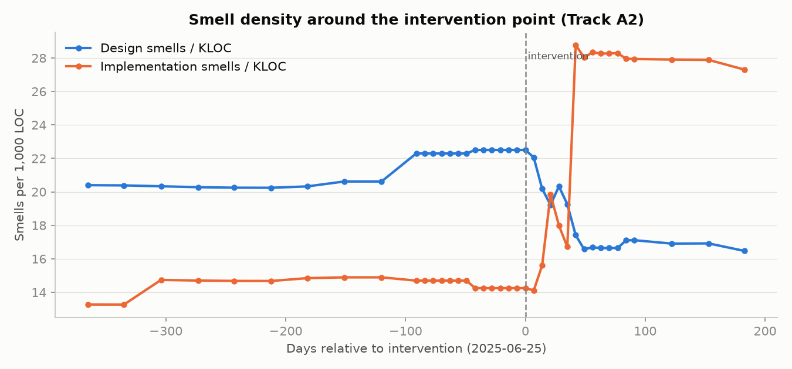

| Metric | Pre-median | Post-median | % change | Mann-Whitney p | Cliff's δ | Magnitude |
|---|---|---|---|---|---|---|
| Design smells / KLOC | 22.30 | 17.10 | **−23.3%** | <0.0001 | 0.83 | large |
| Implementation smells / KLOC | 14.70 | 27.90 | **+89.9%** | <0.0001 | −0.80 | large |
| Testability smells / KLOC | 4.78 | 3.80 | **−20.6%** | 0.0003 | 0.69 | large |

Design-level and implementation-level smells move in **opposite
directions** across the intervention point, both with large effect sizes.
Design smell density (structural issues at the class/component level —
things like Unnecessary/Unutilized Abstraction, cyclic dependencies) and
testability smell density (excessive dependencies, hard-to-test
constructors) both *decreased*. Implementation smell density (method-level
issues — long methods, complex conditionals, duplicated blocks) nearly
*doubled*.

Read alongside the growth-burst chart, this is consistent with a plausible
(not proven) story: a large volume of new code landed quickly during the
growth burst, and it skewed toward implementation-level issues (long
methods, complexity within a method body) more than design-level ones —
while whatever structural/architectural smells existed proportionally
thinned out as the codebase's overall footprint grew. This is exactly the
kind of pattern the study's planned "smell composition" analysis
(`Longitudinal.md` §9 — "does the mix shift, fewer implementation smells vs
more design smells, as agents optimize locally rather than
architecturally?") is designed to catch — here it's the opposite mix shift
than that framing anticipated, worth flagging rather than fitting to prior
expectation.

## 3. Code structure: methods got longer, classes barely changed

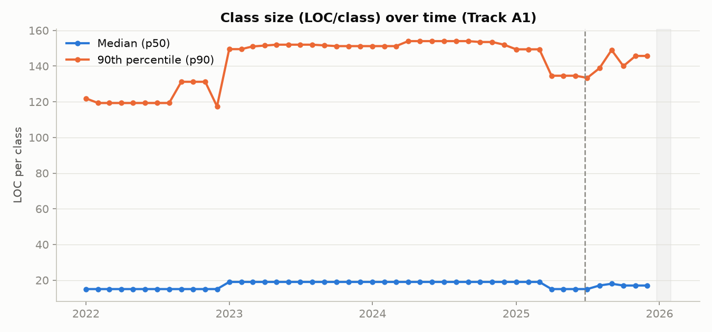

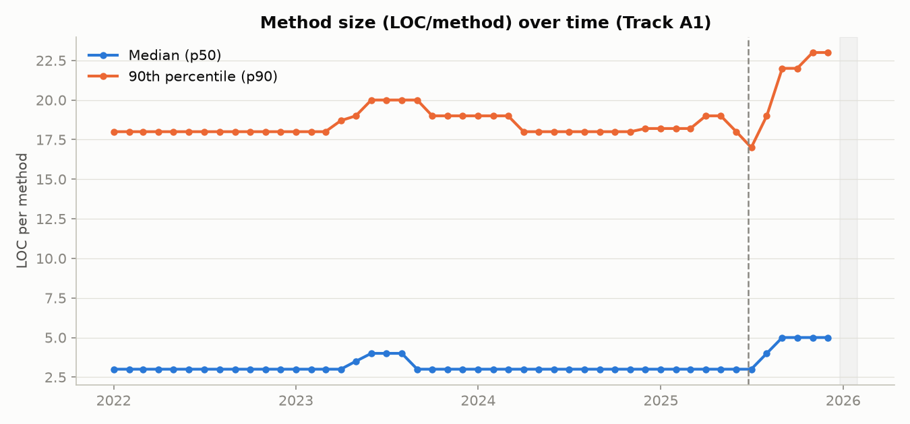

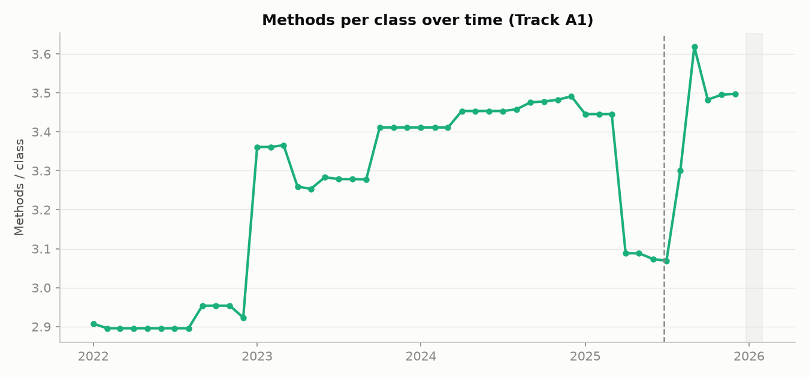

| Metric | Pre-median | Post-median | % change | p | Cliff's δ | Magnitude |
|---|---|---|---|---|---|---|
| Class LOC (p50) | 15.0 | 17.0 | +13.3% | 0.384 | −0.16 | small (n.s.) |
| Class LOC (p90) | 134.6 | 145.7 | +8.2% | 0.728 | 0.07 | negligible (n.s.) |
| Method LOC (p50) | 3.0 | 5.0 | **+66.7%** | <0.0001 | −0.88 | large |
| Method LOC (p90) | 18.0 | 22.0 | +22.2% | 0.022 | −0.43 | medium |
| Methods / class | 3.09 | 3.48 | +12.8% | 0.005 | −0.53 | large |

Class size didn't move in any statistically distinguishable way (both class
LOC comparisons are non-significant). Methods did: the median method grew
from 3 to 5 lines, and the p90 tail from 18 to 22 — a real but modest shift
toward longer method bodies, not toward larger classes. Methods-per-class
also rose, meaning classes gained more methods on average post-intervention,
consistent with feature growth landing inside existing classes rather than
purely via new small ones. The methods-per-class trend chart also shows a
distinct dip immediately *before* the intervention (a brief period of
smaller/thinner classes in early-to-mid 2025) followed by a sharp rebound
right after — worth a closer look at what happened in that pre-intervention
window specifically, outside this report's scope.

## 4. Cyclomatic complexity: flat at the median for the entire history

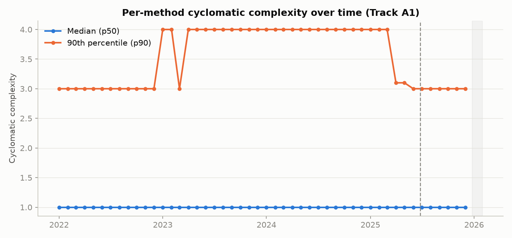

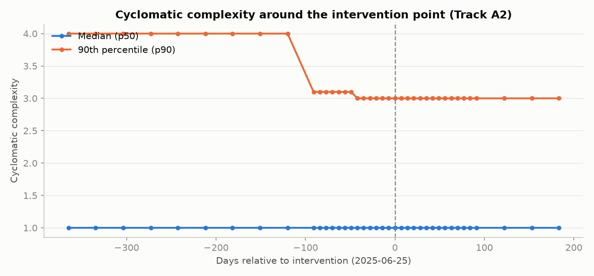

The median per-method cyclomatic complexity is **exactly 1.0 in every one
of the 87 snapshots**, pre- and post-intervention alike — the Mann-Whitney
test is undefined here (zero variance both sides). This means at least half
of Dock's methods are single-branch/trivial (consistent with a
UI/MVVM-heavy codebase full of simple property wrappers and delegating
calls) throughout its entire measured history, and that didn't change with
agent adoption. The p90 tail did move, but modestly and gradually — a
step down from 4.0 to 3.0 that started *before* the intervention (already
visible ~120 days prior) and had fully leveled off by the time of the
intervention itself, so it doesn't line up with the intervention point as a
discontinuity.

## 5. Testability & test-code smells

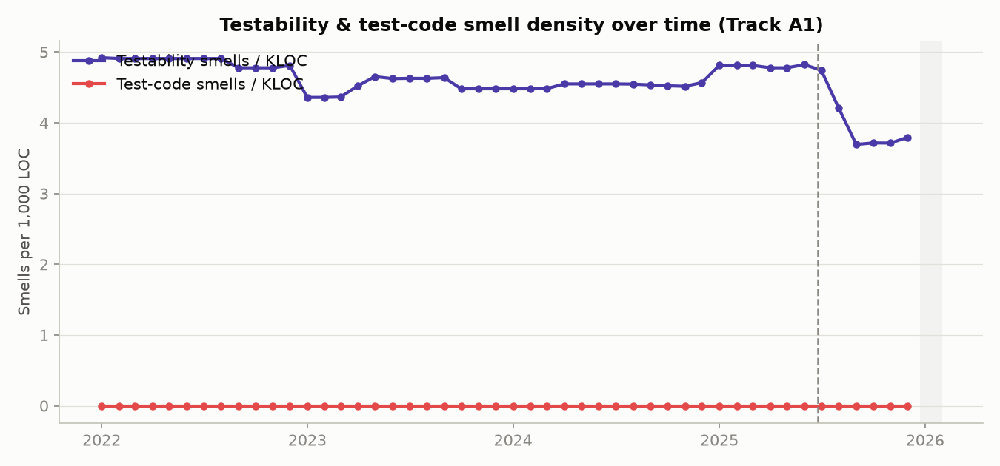

Testability smell density has been on a slow decline since 2022 (~4.9 →
~3.7 per KLOC), with a visible additional drop right around the
intervention. **Test-code smell density (`TestSmells.csv`) is flat at
exactly zero across all 87 snapshots.** That's either a genuinely
smell-free test suite by Designite's definition for this entire 4-year
window, or this smell category isn't triggering for Dock's specific test
project setup — worth independently verifying against Designite's
documentation before treating "zero test smells" as a real finding rather
than a detection gap.

## 6. How these metrics relate to each other

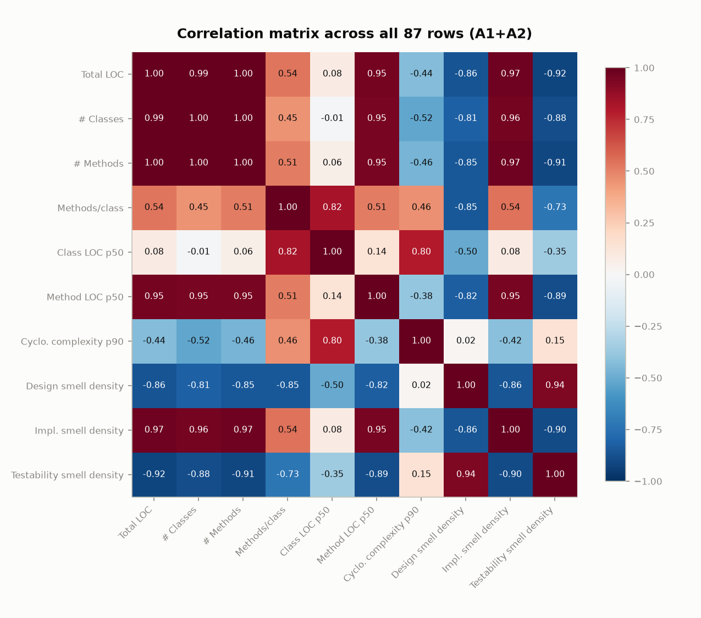

Unsurprising but worth confirming directly: total LOC, class count, and
method count are almost perfectly collinear (r ≥ 0.99) — Dock grows by
adding classes and methods roughly proportionally, not by inflating
existing ones. Design smell density and testability smell density are
strongly *negatively* correlated with size (r ≈ −0.86 to −0.92) — both
"dilute" as the codebase grows, exactly the pattern in §2. Implementation
smell density does the opposite — it's strongly *positively* correlated
with size (r = 0.97) — reinforcing that the post-intervention rise in
implementation-smell density in §2 isn't independent noise; it's the same
size relationship holding throughout the whole 4-year history, not
something unique to the post-intervention window. `cyclomatic_complexity_p50`
is omitted from this matrix entirely — it's constant, so its correlation
with anything is mathematically undefined.

## Synthesis

Three things are true simultaneously and are worth holding together rather
than picking one headline:

1. **Dock grew explosively right at the intervention point** — a fact on
   its own, regardless of what caused it.
2. **Design-level and testability smell density improved** (large effect,
   both directions consistent with the repo's whole-history size
   relationship in §6) **while implementation-level smell density worsened**
   (also large, also consistent with the whole-history relationship) —
   these look like continuations of pre-existing size/density relationships
   playing out at a much larger scale and faster pace, not necessarily a
   change in the *relationship itself*.
3. **Method bodies got moderately longer; classes and cyclomatic complexity
   barely moved.** The growth was absorbed mostly as more, and moderately
   longer, methods within existing/new classes — not as more deeply nested
   or branchy logic.

None of this establishes causation, and the truncated post-window (~6
months, not ~12) plus n=1 repo means it shouldn't be read as a verdict on
"AI agents and code quality" beyond Dock itself. It's a clean, concrete
descriptive picture worth carrying into the pooled, covariate-adjusted
analysis once DPy's repos join it.

## Reproducing this analysis

`src/phase0/analyze_dock_designite.py` regenerates every figure in this
report plus `Writing/figures/dock_designite/pre_post_stats.csv` (the full
pre/post statistics table) from `results/analysis/07-28-smell-metrics-96.csv`.
Requires `scipy` (not otherwise a dependency of this repo's `phase0`
scripts — `pip install scipy`). This report itself is hand-written, not
auto-generated — re-run the script and re-check the numbers here if the
underlying CSV changes.
